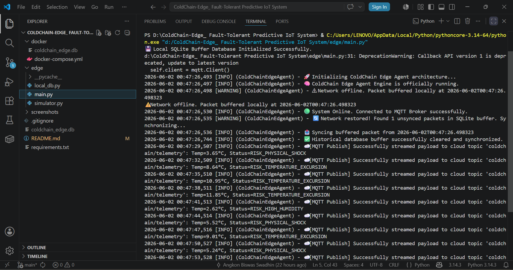
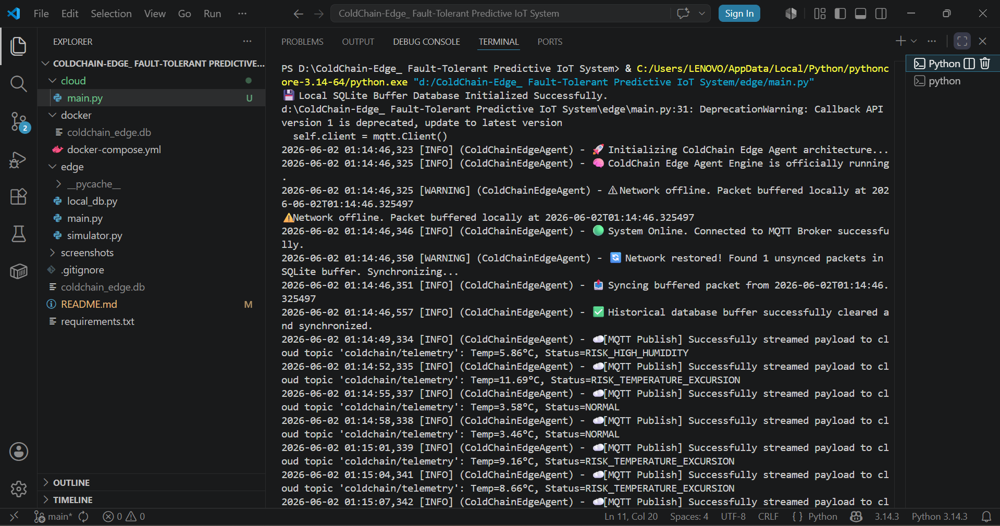
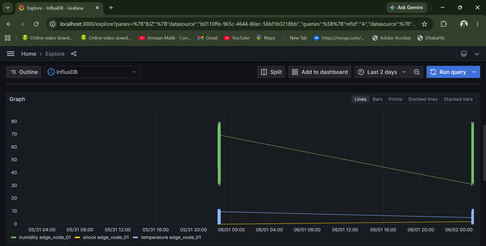
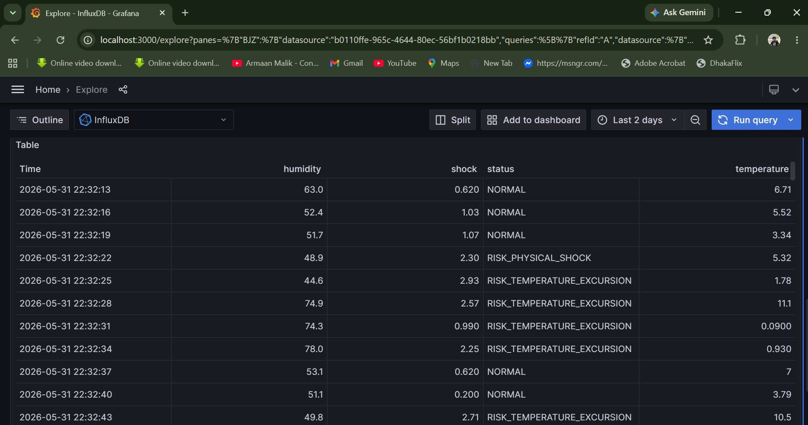

# IoT-Based Cold Chain Logistics Monitoring System

A robust, end-to-end, and fault-tolerant IoT architecture designed for real-time monitoring of sensitive cargo (such as pharmaceuticals or perishable foods) during transit. The system monitors critical environmental metrics—**Temperature, Humidity, and Physical Shock**—and provides edge-level risk analysis and cloud-based real-time visualization.

---

## 📷 System Previews & Dashboards
Here is the live system in action, demonstrating the end-to-end data pipeline and live monitoring dashboards:

### 1. Edge Agent Terminal (`edge/main.py`)
Generates sensor telemetry, analyzes risks at the edge, handles local SQLite buffering, and streams payload to the cloud MQTT broker.


### 2. Cloud Ingestor Terminal (`cloud/main.py`)
Subscribes to the MQTT topic, receives real-time streams, and successfully writes payloads to InfluxDB.


### 3. Grafana Real-Time Visualization
**Time-Series Analytics & Trends**
Live monitoring charts displaying shifting trends for temperature, humidity, and critical physical shock occurrences.


### 4. Edge Risk Alert Tracking (Table View)
Real-time synchronized data logs capturing system-generated risk statuses (NORMAL, RISK_PHYSICAL_SHOCK, etc.).


## 🚀 Features

- **Edge Intelligence & Risk Analytics:** Real-time analysis of sensor data at the edge to detect risks like `RISK_PHYSICAL_SHOCK` or `RISK_TEMPERATURE_EXCURSION`.
- **Fault-Tolerant Local Storage:** Offline-first design. If internet/MQTT connectivity drops, data is automatically buffered into a local SQLite database and synchronized with the cloud once connection resumes.
- **Asynchronous Data Pipeline:** Lightweight and fast telemetry streaming using MQTT protocol.
- **Time-Series Data Management:** Cloud ingestor service seamlessly writes data into InfluxDB v2.x.
- **Live Dashboards:** Rich, real-time analytics and telemetry tracking using Grafana.

---

## 🏗️ Architecture & Data Flow

[Edge Sensors/Simulator] 
       │
       ▼ (Edge Analytics & SQLite Backup if Offline)
[edge/main.py]
       │
       ▼ (MQTT Publish - Topic: coldchain/telemetry)
  [MQTT Broker]
       │
       ▼ (MQTT Subscribe)
[cloud/main.py]
       │
       ▼ (InfluxDB Client API)
   [InfluxDB] 
       │
       ▼ (Flux Query)
   [Grafana]

---

## 🛠️ Tech Stack

- **Languages:** Python
- **IoT & Protocols:** MQTT (Paho-MQTT), Edge Computing
- **Edge AI & TinyML:** Lightweight anomaly detection & predictive risk alerting
- **Database:** SQLite (Local Buffering), InfluxDB (Cloud Storage)
- **Containerization:** Docker & Docker Compose
- **Visualization:** Grafana

---

## 📂 Project Structure

```text
├── edge/
│   ├── main.py              # Edge agent (Data generation, analytics, local storage, MQTT client)
│   ├── simulator.py         # Dummy sensor payload simulator
│   └── Coldchain_edge.db    # Local SQLite database (Automatically generated for offline buffering)
├── cloud/
│   └── main.py              # Cloud ingestor (MQTT subscriber & InfluxDB writer)
├── screenshots/             # Application previews and Grafana dashboards
│   ├── edge_agent.png
│   ├── cloud_ingestor.png
│   ├── grafana_dashboard.png
│   └── grafana_table_logs.png
├── docker-compose.yml       # Docker setup for InfluxDB, Grafana, and MQTT Broker
├── .gitignore               # Specifies intentionally untracked files to ignore
├── requirements.txt         # Python dependencies list
└── README.md

⚙️ Setup & Installation
​1. Prerequisites
​Make sure you have Docker, Docker Compose, and Python installed on your system.
​2. Spin up the Infrastructure
​Run the docker-compose file to start the MQTT Broker, InfluxDB, and Grafana containers:
         docker-compose up -d
3. Install Dependencies
​Navigate to your project directory and install required Python packages:
         pip install paho-mqtt influxdb-client

🏃 How to Run
​To test the entire live pipeline, you need to run both the edge and cloud services in separate terminals.
​Step 1: Start the Cloud Ingestor
​This service listens to the MQTT broker and writes incoming payloads to InfluxDB.
python cloud/main.py

Step 2: Start the Edge Agent
​This service simulates/reads sensor data, evaluates risks, and streams it to the cloud.
python edge/main.py

📊 Grafana Visualization
​Open Grafana at http://localhost:3000.
​Add InfluxDB as a Data Source (using Flux query language).
​Query the telemetry_bucket to build real-time time-series graphs and status tables.
// Example Flux Query for Temperature Tracking
from(bucket: "telemetry_bucket")
  |> range(start: -15m)
  |> filter(fn: (r) => r["_measurement"] == "telemetry")
  |> filter(fn: (r) => r["_field"] == "temperature")